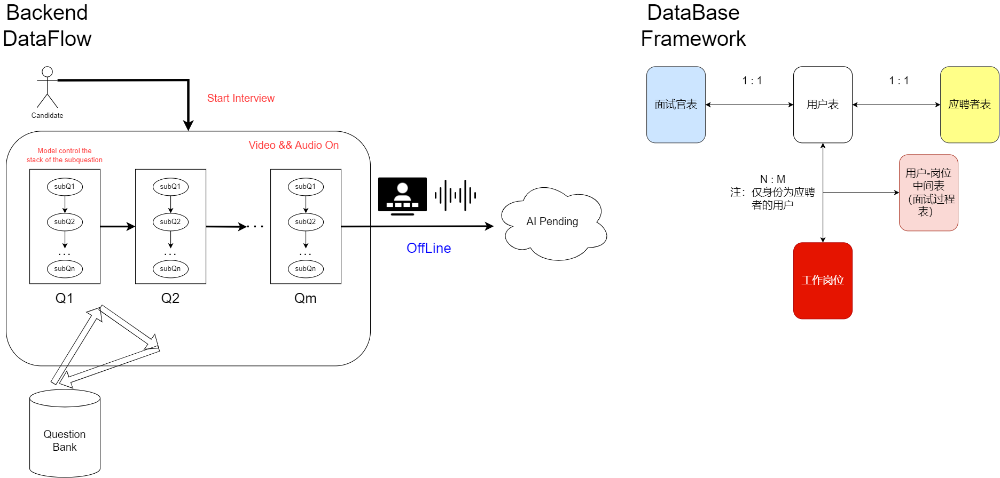

## 问见未来 · 视听多模态AI面试系统解决方案

### AskVistaX · Video and Audio MultiModal AI Interview System Solution for the 19th Challenge Cup

[TOC]

### 后端设计

接口文档详见：[问见未来askVistaX PostMan接口文档](https://documenter.getpostman.com/view/32022529/2sB34mhxzq)（注：持续开发中）

#### 数据库设计

##### 用户表 users

| <u>uid</u> | ==userAccount== | passwordHash | userName       | roleType       | avatar     |
| ---------- | --------------- | ------------ | -------------- | -------------- | ---------- |
| 用户标号   | 用户账号        | 哈希后的密码 | 用户名         | 身份类型       | 头像url    |
| **birth**  | **phone**       | **email**    | **createTime** | **updateTime** | **gender** |
| 出生年月   | 联系电话        | 用户邮箱     | 创建时间       | 修改时间       | 性别       |

***roleType*** 身份类型：其中0为系统管理员，1为面试官，2为应聘者

***gender*** 用户性别：其中0为保密，1为男性，2为女性

##### 应聘者表 candidates

| candId   | realName | education | university | major | applyType | userAccount |
| -------- | -------- | --------- | ---------- | ----- | --------- | ----------- |
| 应聘编号 | 真实姓名 | 教育程度  | 毕业院校   | 专业  | 应聘类型  | 关联账号    |

***education*** 教育程度：其中0为其他，1为普通本科，2为硕士，3为博士，4为博士后

***applyType*** 应聘类型：其中0为校园招聘，1为社会招聘

##### 面试官/系统管理员表 interviewers

| interId    | realName | businessGroup | department | rankLevel | position | userAccount |
| ---------- | -------- | ------------- | ---------- | --------- | -------- | ----------- |
| 面试官编号 | 真实姓名 | 事业群        | 部门       | 职级      | 职位     | 关联账号    |

##### 工作岗位表 posts

| postId       | postName | postDescription | postRequirement | postNote         | postLocation | postBusinessGroup |
| ------------ | -------- | --------------- | --------------- | ---------------- | ------------ | ----------------- |
| 工作岗位编号 | 岗位名称 | 岗位描述        | 岗位要求        | 加分项或注意事项 | 工作地点     | 招聘事业群        |

### 算法设计

### 前端设计
